<div align="center">

# 🍽️ Food For You

### แอปสั่งอาหารแบบ Contactless ยุค Covid-19

*ออเดอร์เด้งเข้าหลังร้านทันที — พร้อมระบบจัดการคิวและสรุปยอดขายครบวงจร*

[](https://flutter.dev)
[](https://dart.dev)
[](https://firebase.google.com)
[](https://developer.android.com/studio)

[](https://github.com/gong-sn-ix-ii/Food-For-You-Mobile-Application)
[](https://flutter.dev)
[](https://github.com/gong-sn-ix-ii/Food-For-You-Mobile-Application)
[](https://gong-ix-ii-dev.com)

</div>

---

## ✨ ภาพรวมโปรเจกต์

**Food For You** คือแอปพลิเคชันสั่งอาหารที่พัฒนาขึ้นเพื่อตอบโจทย์วิถีชีวิตใน **ยุค Covid-19 (Contactless)** ช่วยลดการสัมผัสและลดความหนาแน่นหน้าร้านอาหาร

ลูกค้าสามารถสั่งอาหารผ่านมือถือได้อย่างง่ายดาย เมื่อยืนยันออเดอร์แล้ว ออเดอร์จะ **"เด้งเข้าหลังร้านทันที"** แบบ Real-time พร้อมระบบจัดการคิว, Cooking Screen สำหรับครัว, และกราฟสรุปยอดขายให้กับผู้ประกอบการอย่างครบวงจร

> 💡 **แนวคิดหลัก**
> ออกแบบเพื่อให้ทั้ง **ลูกค้า** และ **ร้านค้า** ใช้งานง่ายในแอปเดียว — ลูกค้าได้ความสะดวกในการสั่งและติดตามคิว ส่วนร้านค้าได้ระบบหลังบ้านสำหรับบริหารจัดการครบทุกขั้นตอน ตั้งแต่รับออเดอร์ จัดทำอาหาร ปิดบิล ไปจนถึงดู Dashboard ยอดขาย

---

## 🎯 ฟีเจอร์หลัก

| ฟีเจอร์ | รายละเอียด |
|---|---|
| ⚡ **Real-time Order & Sync** | ลูกค้าสั่งอาหารผ่านแอป ออเดอร์เด้งเข้าหน้าจอหลังร้านทันทีแบบ Real-time ลดความผิดพลาดในการจดออเดอร์ และลดการสัมผัส (Contactless) |
| 📊 **Smart Merchant Dashboard** | ระบบหลังบ้านครบวงจรสำหรับร้านค้า มี **Cooking Screen** จัดการคิวทำอาหารเป็นระบบ พร้อมกราฟแสดงสถิติและสรุปยอดขายรายวันแบบละเอียด |
| 🔁 **Full-Loop User Experience** | ครอบคลุมทุกการใช้งาน — ค้นหาเมนู, ติดตามสถานะคิว, สแกน QR Code, ให้คะแนนรีวิว, จนถึงช่องทาง Support & Chat จบในแอปเดียว |
| 📱 **QR Code Integration** | สร้างและสแกน QR Code สำหรับการสั่งอาหารบนโต๊ะหรือออนไลน์ — สะดวกสำหรับทั้งลูกค้าและร้าน |
| 📈 **Sales Analytics** | Dashboard สรุปสถิติยอดขาย, ประวัติออเดอร์, และข้อมูลที่ผู้ประกอบการสามารถใช้วิเคราะห์ธุรกิจได้ |
| 💬 **In-app Support** | ช่องทางการแจ้งปัญหาและขอความช่วยเหลือในแอป โดยไม่ต้องออกไปติดต่อช่องทางอื่น |

---

## 📱 หน้าจอการใช้งาน (18 หน้า)

แอปแบ่งเป็น 2 ฝั่ง: **ฝั่งลูกค้า (Customer Side)** และ **ฝั่งร้านค้า (Merchant Side)**

<table>
<tr>
<td width="50%">

### 1. หน้าแรก (Welcome)
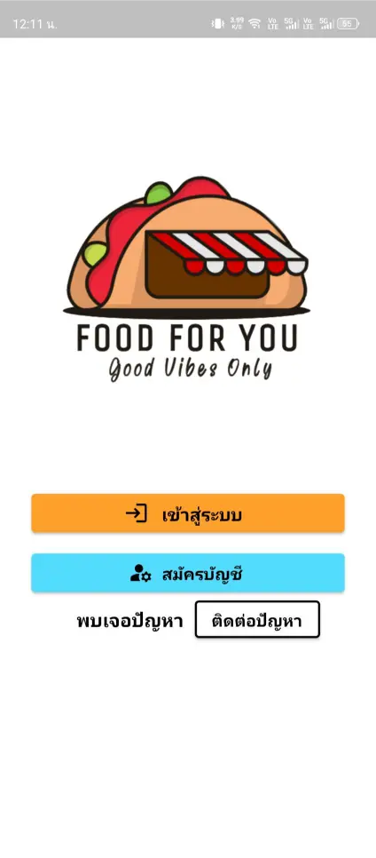

หน้าแรกของแอปพลิเคชัน FoodForYou สำหรับเริ่มต้นการใช้งาน

</td>
<td width="50%">

### 2. เข้าสู่ระบบ
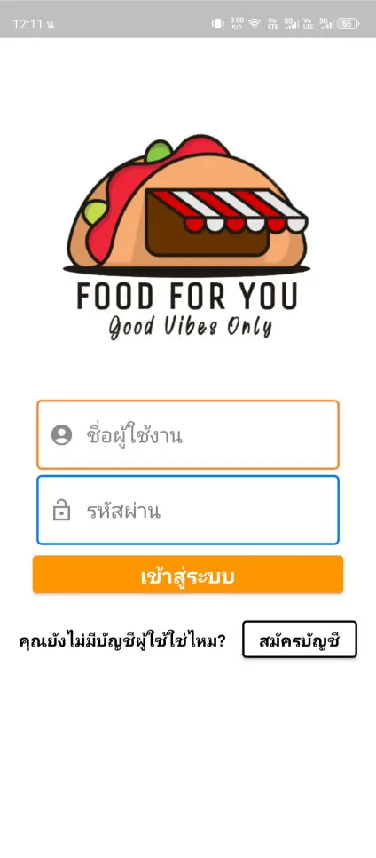

หน้าต่างเข้าสู่ระบบสำหรับผู้ใช้งาน

</td>
</tr>
<tr>
<td width="50%">

### 3. สมัครสมาชิก
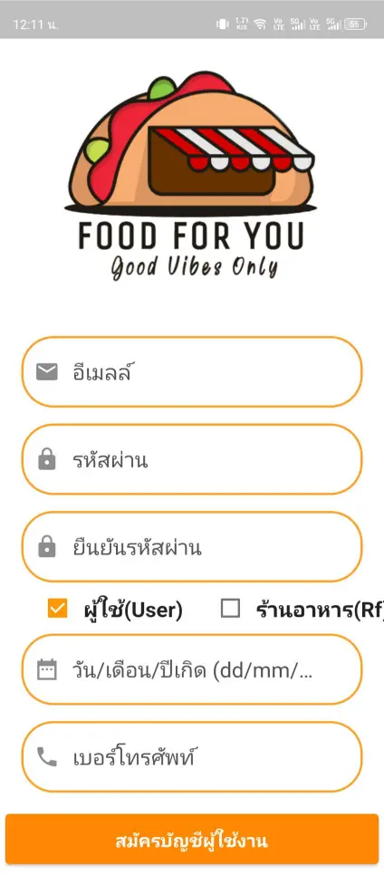

หน้าลงทะเบียนและสมัครบัญชีผู้ใช้งานใหม่

</td>
<td width="50%">

### 4. หน้าหลัก (Main Order)
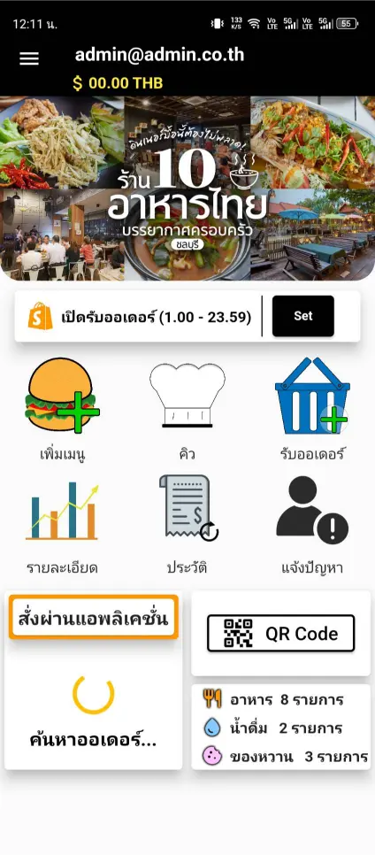

หน้าหลักของแอปสำหรับจัดการและทำรายการออเดอร์

</td>
</tr>
<tr>
<td width="50%">

### 5. เมนูร้านอาหาร
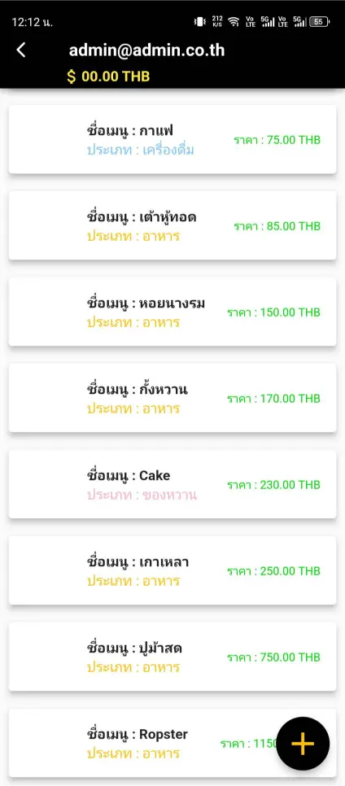

แสดงรายการเมนูอาหารทั้งหมดพร้อมราคาของร้าน

</td>
<td width="50%">

### 6. จัดการเมนู
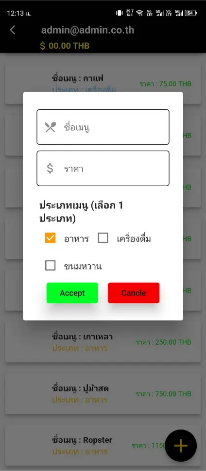

ระบบจัดการเพิ่มรายการอาหารและหมวดหมู่เมนูของร้าน

</td>
</tr>
<tr>
<td width="50%">

### 7. สั่งอาหารแบบเร็ว
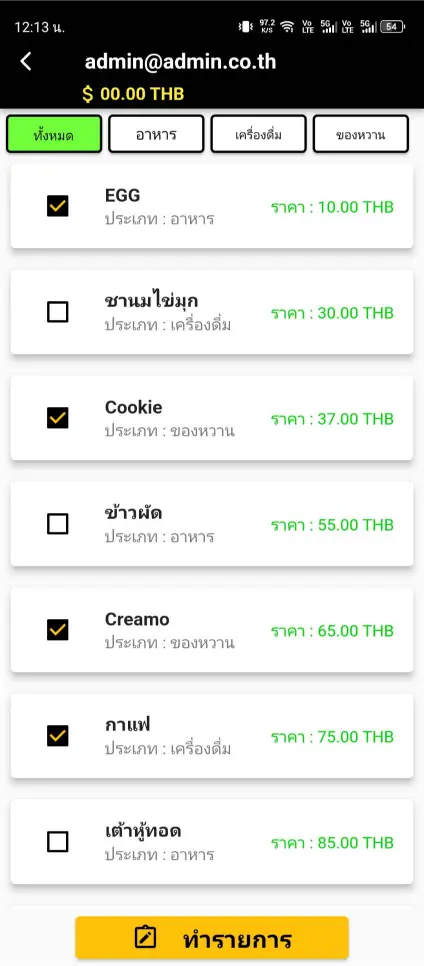

บันทึกรายการอาหารที่เลือกเพื่อความรวดเร็วในการสั่งซื้อ

</td>
<td width="50%">

### 8. ระบบกำลังประมวลผล
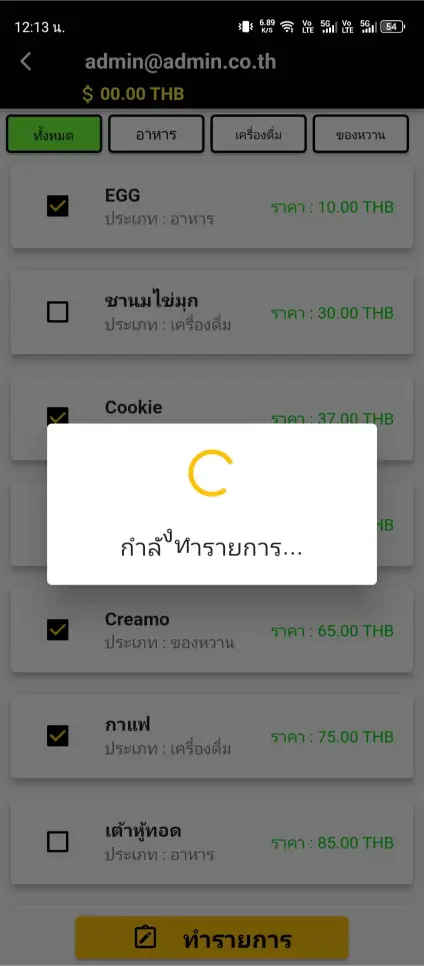

แสดงสถานะกำลังดำเนินการระบบ

</td>
</tr>
<tr>
<td width="50%">

### 9. สรุปออเดอร์
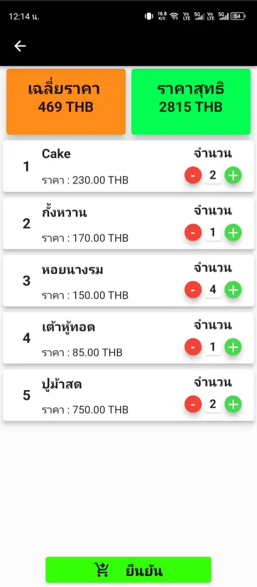

ระบุจำนวนรายการอาหารที่สั่ง พร้อมแสดงสรุปยอดชำระเงินรวม

</td>
<td width="50%">

### 10. คิวออเดอร์ (ฝั่งร้าน)
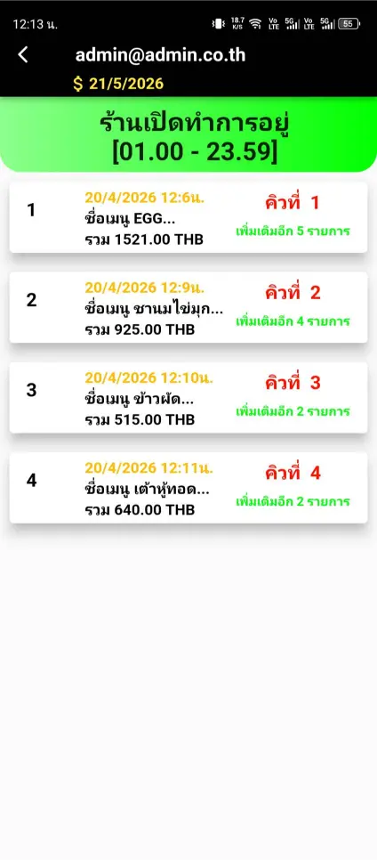

ระบบฝั่งร้านอาหารสำหรับรับออเดอร์ พร้อมแสดงคิวที่ต้องจัดเตรียม

</td>
</tr>
<tr>
<td width="50%">

### 11. ติดตามสถานะออเดอร์
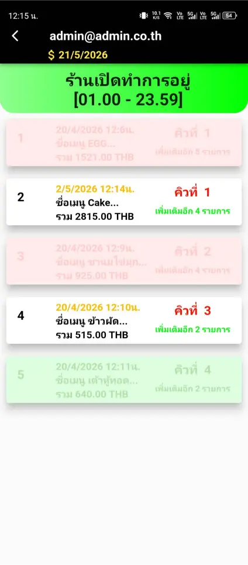

แสดงรายการออเดอร์ที่ดำเนินการสำเร็จและออเดอร์ที่ถูกยกเลิก

</td>
<td width="50%">

### 12. รายละเอียดออเดอร์
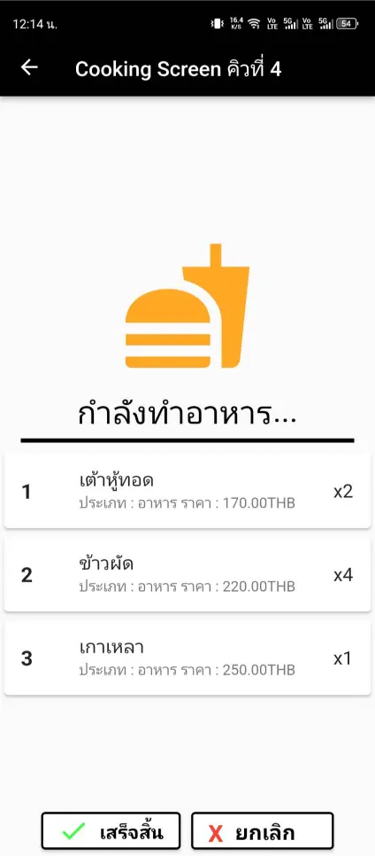

แสดงรายละเอียดเมนูอาหารที่ต้องจัดเตรียมในแต่ละคิว

</td>
</tr>
<tr>
<td width="50%">

### 13. ยืนยันออเดอร์
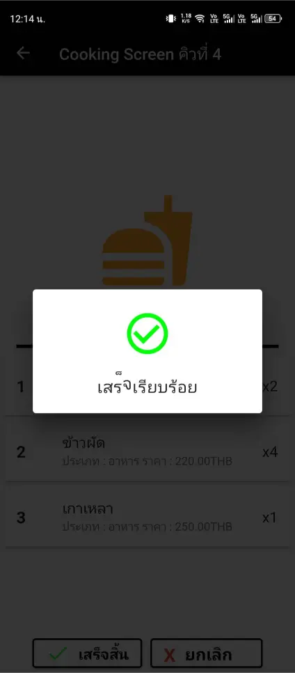

จัดการสถานะออเดอร์ (เสร็จสิ้น/ยกเลิก) เพื่อสรุปและบันทึกลงระบบ

</td>
<td width="50%">

### 14. ประวัติออเดอร์
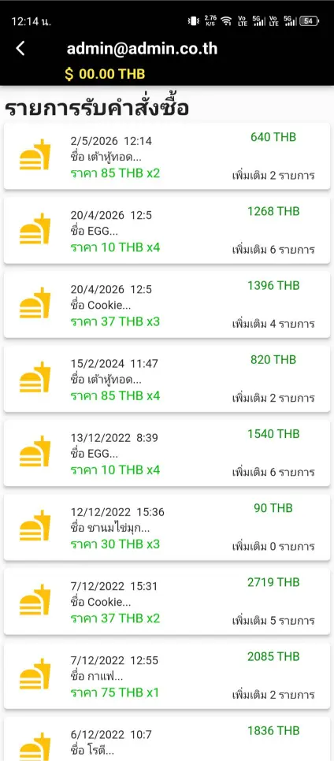

แสดงประวัติการสั่งซื้อที่เสร็จสิ้น พร้อมสรุปรายการและยอดชำระ

</td>
</tr>
<tr>
<td width="50%">

### 15. Sales Dashboard
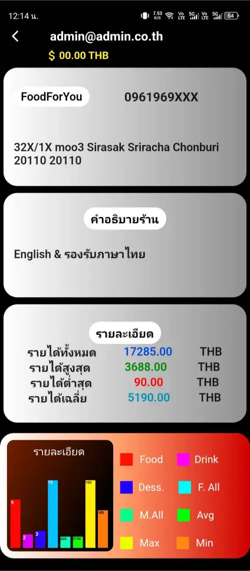

หน้าแดชบอร์ดสรุปข้อมูลสถิติและยอดขายทั้งหมดของร้านอาหาร

</td>
<td width="50%">

### 16. Help & Support
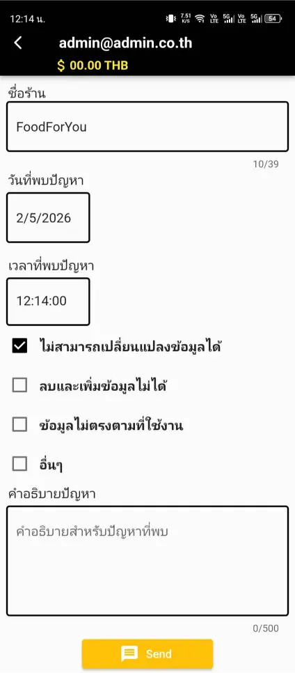

ช่องทางสำหรับแจ้งปัญหาการใช้งานหรือขอความช่วยเหลือ

</td>
</tr>
<tr>
<td width="50%">

### 17. จัดการ QR Code
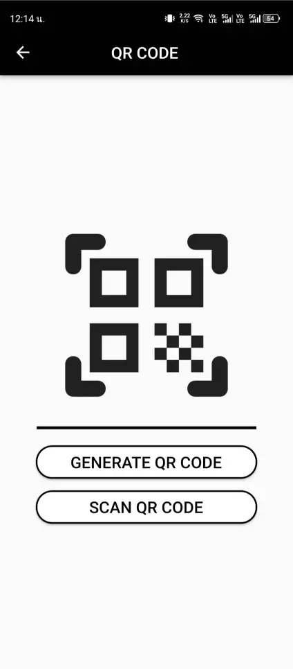

ฟังก์ชันสร้างและสแกน QR Code สำหรับระบบการสั่งอาหารออนไลน์

</td>
<td width="50%">

### 18. QR Code Scanner
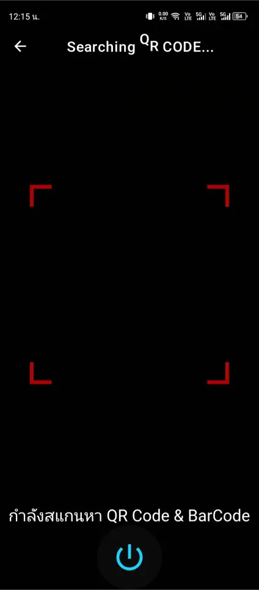

หน้าต่างใช้งานกล้องสำหรับสแกน QR Code เพื่อทำรายการ

</td>
</tr>
</table>

---

## 🛠 เทคโนโลยีที่ใช้

<div align="center">

| | Technology | บทบาท |
|---|---|---|
|  | **Flutter** | Cross-platform UI Framework สำหรับ Android & iOS |
|  | **Dart** | ภาษาหลักในการเขียน Logic ของแอป |
|  | **Firebase** | Real-time Database, Authentication, Cloud Storage |
|  | **Android Studio** | IDE หลักสำหรับพัฒนา |

</div>

---

## 🚀 วิธีติดตั้งและรันโปรเจกต์

### สิ่งที่ต้องเตรียม (Prerequisites)

- Flutter SDK `>= 3.0.0`
- Dart SDK `>= 3.0.0`
- Android Studio หรือ VS Code (ติดตั้ง Flutter plugin แล้ว)
- Firebase Project ที่เปิด Authentication, Firestore, Cloud Storage
- กล้องบนอุปกรณ์ (สำหรับฟีเจอร์ QR Code Scanner)

### ขั้นตอนการติดตั้ง

```bash
# 1. Clone repository
git clone https://github.com/gong-sn-ix-ii/Food-For-You-Mobile-Application.git
cd Food-For-You-Mobile-Application

# 2. ติดตั้ง dependencies ทั้งหมด
flutter pub get

# 3. เชื่อมต่อ Firebase Project ของคุณ
# วาง google-services.json ไว้ที่ android/app/
# วาง GoogleService-Info.plist ไว้ที่ ios/Runner/

# 4. รันแอปพลิเคชัน
flutter run
```

### Build สำหรับ Production

```bash
flutter build apk --release       # สำหรับ Android
flutter build ios --release       # สำหรับ iOS
```

---

## 📂 โครงสร้างโปรเจกต์

```
Food-For-You-Mobile-Application/
├── lib/
│   ├── main.dart                 # จุดเริ่มต้นของแอป
│   ├── screens/                  # หน้าจอทั้งหมด (Customer + Merchant)
│   │   ├── customer/             # ฝั่งลูกค้า
│   │   └── merchant/             # ฝั่งร้านค้า (Cooking Screen, Dashboard)
│   ├── widgets/                  # UI Components ที่ใช้ซ้ำ
│   ├── services/                 # Firebase + Business Logic
│   ├── models/                   # Data Models
│   └── utils/                    # Helpers & Constants
├── assets/
│   └── images/
├── android/
├── ios/
└── pubspec.yaml
```

---

## 🎯 กลุ่มเป้าหมาย

โปรเจกต์นี้ออกแบบมาเพื่อ 2 กลุ่มผู้ใช้:

- 🍽️ **ลูกค้า (Customer)** — สั่งอาหารผ่านมือถือ ติดตามคิว ดูประวัติ และให้คะแนนรีวิว
- 🏪 **ร้านอาหาร / ผู้ประกอบการ (Merchant)** — รับออเดอร์ จัดการเมนู ดู Dashboard ยอดขาย และจัดการ QR Code

---

## 👨‍💻 ผู้พัฒนา

<table>
<tr>
<td>

### Kitsada Khamnuan (กฤษฎา คำนวน)

*Junior Software Engineer · Mobile Developer · Cybersecurity Enthusiast*

📍 ชลบุรี / กรุงเทพฯ, ประเทศไทย

🌐 **Portfolio:** [gong-ix-ii-dev.com](https://gong-ix-ii-dev.com)
💼 **GitHub:** [@gong-sn-ix-ii](https://github.com/gong-sn-ix-ii)
💬 **LinkedIn:** [Kitsada Khamnuan](https://www.linkedin.com/in/kitsada-khamnuan-2a6729407/)

</td>
</tr>
</table>

---

## 📄 License

โปรเจกต์นี้พัฒนาเพื่อการศึกษาและใช้เป็น Portfolio กรุณาติดต่อผู้พัฒนาก่อนนำไปใช้ในเชิงพาณิชย์

---

<div align="center">

**⭐ ถ้าคุณชอบโปรเจกต์นี้ ฝากกด Star เป็นกำลังใจให้ผู้พัฒนาด้วยนะครับ ⭐**

Made with 🧡 by [Kitsada Khamnuan](https://gong-ix-ii-dev.com)

</div>

---
